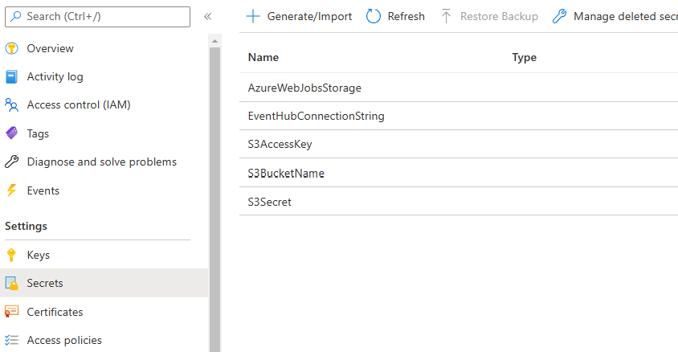
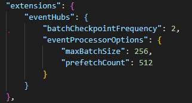

# Azure EventHub to AWS S3 Bucket: Azure Functions Demo

This code will demonstrate the movement of events from Azure [Event Hub](https://azure.microsoft.com/en-us/services/event-hubs) to files saved in an AWS S3 Bucket with the use of [Azure Functions](https://azure.microsoft.com/en-us/services/functions/).\
In addition, it will demonstrate the use if [Key Vault](https://azure.microsoft.com/en-us/services/key-vault/) to securely store your connection strings and access keys.

Contents:

- [Pre-requisites](#pre-requisites)
- [Getting Started](#getting-started)
  - [Deploy the Azure Resources and Demo Function](#deploy-the-azure-resources-and-demo-function)
  - [Add the S3 Secrets to Key Vault](#add-the-s3-secrets-to-key-vault)
- [Run the Demo](#run-the-demo)
- [Optimizing Event Processing Throughput](#optimizing-event-processing-throughput)
## Pre-requisites

1. Before you start, you will need to create an AWS S3 bucket and obtain the following:

    - Bucket Name
    - Access Key
    - Secret

    These values will be used to access the S3 bucket.

2. Install the [Azure CLI ](https://docs.microsoft.com/en-us/cli/azure/install-azure-cli)
3. Install the [.NET 6 SDK](https://dotnet.microsoft.com/download)

## Getting Started

### Deploy the Azure Resources and Demo Function

You can easily deploy the Azure resources with the supplied script: `deploy.ps1`. In a PowerShell window, run:

``` Powershell
az login

.\deploy.ps1 -resourceGroupName "<resource group>" -location "<Azure region>" -functionAppName "<name of funciton app>"

```

This script will deploy the following resources:

- App Service Plan - the hosting environment for the Function App
- Function App - the app where the demo code will be deployed to
- Event Hub Namespace and Event Hub - this will be the source of the events that the function will pull from
- Key vault - for the secure storage of the S3 secrets as well as the Event Hub connection string
- Storage Account - needed for the Azure function
- Application insights - for storing Function metrics and log information

The script will also compile and deploy the Function code in the EventHubToS3 project and compile and configure the appsettings.json for the EventProducer project.


### Add the S3 Secrets to Key Vault

The deployment script created three placeholder secrets that you will need to update to the actual values for your S3 bucket. So set the values, login to the Azure portal (https://portal.azure.com) and navigate to the the resource group you created. In that group, find the Key Vault resource and click on the `Secrets` link. Then, click on each of the S3 items (`S3AccessKey`, `S3BucketName` and `S3Secret`) and add a `New Version` of the secret with the actual values from your Bucket.



## Run the Demo

The EventProducer project contains demo code to produce events into the Event Hub. You can use the code as-is to create sample event messages, or modify the code to produce an event message that better simulates your use case. Once you have made any necessary changes, you can re-compile the code and run it. If you don't provide any arguments, it will produce 100 events, or you can add an integer argument to the command line to produce that many events.

Once the events are created, you can monitor your Function app in the Azure portal either through attaching to the live logs or by monitoring Application Insights.

## Optimizing Event Processing Throughput

To optimize the reading and processing of events, first start with the `host.json` file in the EventHubToS3 project. The first items to look at are the `maxBatchSize` and `prefetchCount` as described [here](https://docs.microsoft.com/en-us/azure/azure-functions/functions-bindings-event-hubs#hostjson-settings)



A larger value for `maxBatchSize` will reduce network latency but needs to be balanced with memory and processor load (and can not exceed the `prefetchCount` value). These can be monitored in Application Insights. If you want to modify the values you can update the `host.json` file and either compile and deploy the code yourself or rerun the `deploy.ps1` script with the same values use used to create the resources (it will not overwrite your S3 secrets already in the Key Vault)

If you are not getting the throughput you desire, you may need to change your hosting plan to [Azure Function Premium Plan](https://docs.microsoft.com/en-us/azure/azure-functions/functions-premium-plan?tabs=portal)


For reference, there is an article that describes optimization on [medium.com](https://medium.com/@iizotov/azure-functions-and-event-hubs-optimising-for-throughput-549c7acd2b75)